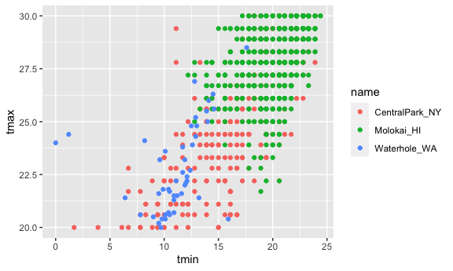

EDA and numeric summaries
================
ASHLEY ROMO
2023-10-05

``` r
library(tidyverse)
```

    ## ── Attaching core tidyverse packages ──────────────────────── tidyverse 2.0.0 ──
    ## ✔ dplyr     1.1.3     ✔ readr     2.1.4
    ## ✔ forcats   1.0.0     ✔ stringr   1.5.0
    ## ✔ ggplot2   3.4.3     ✔ tibble    3.2.1
    ## ✔ lubridate 1.9.2     ✔ tidyr     1.3.0
    ## ✔ purrr     1.0.2     
    ## ── Conflicts ────────────────────────────────────────── tidyverse_conflicts() ──
    ## ✖ dplyr::filter() masks stats::filter()
    ## ✖ dplyr::lag()    masks stats::lag()
    ## ℹ Use the conflicted package (<http://conflicted.r-lib.org/>) to force all conflicts to become errors

``` r
library(patchwork)

# setting the width and height of the plots
knitr::opts_chunk$set(
  fig.width = 6,
  fig.asp = .6,
  out.width = "90%"
)
```

``` r
weather_df = 
  rnoaa::meteo_pull_monitors(
    c("USW00094728", "USW00022534", "USS0023B17S"),
    var = c("PRCP", "TMIN", "TMAX"), 
    date_min = "2021-01-01",
    date_max = "2022-12-31") |>
  mutate(
    name = recode(
      id, 
      USW00094728 = "CentralPark_NY", 
      USW00022534 = "Molokai_HI",
      USS0023B17S = "Waterhole_WA"),
    tmin = tmin / 10,
    tmax = tmax / 10,
    month = lubridate::floor_date(date, unit = "month"))|>
  select(name, id, everything())
```

    ## using cached file: /Users/ashleyromo/Library/Caches/org.R-project.R/R/rnoaa/noaa_ghcnd/USW00094728.dly

    ## date created (size, mb): 2023-10-05 18:05:30.264135 (8.534)

    ## file min/max dates: 1869-01-01 / 2023-10-31

    ## using cached file: /Users/ashleyromo/Library/Caches/org.R-project.R/R/rnoaa/noaa_ghcnd/USW00022534.dly

    ## date created (size, mb): 2023-10-05 18:05:45.821928 (3.839)

    ## file min/max dates: 1949-10-01 / 2023-10-31

    ## using cached file: /Users/ashleyromo/Library/Caches/org.R-project.R/R/rnoaa/noaa_ghcnd/USS0023B17S.dly

    ## date created (size, mb): 2023-10-05 18:05:50.763023 (0.997)

    ## file min/max dates: 1999-09-01 / 2023-10-31

## Initial numeric work

``` r
weather_df |> 
  ggplot(aes(x = prcp)) +
  geom_histogram()
```

    ## `stat_bin()` using `bins = 30`. Pick better value with `binwidth`.

    ## Warning: Removed 15 rows containing non-finite values (`stat_bin()`).


here are the big outliers

``` r
weather_df |> 
  filter(prcp > 1000)
```

    ## # A tibble: 3 × 7
    ##   name           id          date        prcp  tmax  tmin month     
    ##   <chr>          <chr>       <date>     <dbl> <dbl> <dbl> <date>    
    ## 1 CentralPark_NY USW00094728 2021-08-21  1130  27.8  22.8 2021-08-01
    ## 2 CentralPark_NY USW00094728 2021-09-01  1811  25.6  17.2 2021-09-01
    ## 3 Molokai_HI     USW00022534 2022-12-18  1120  23.3  18.9 2022-12-01

``` r
weather_df |> 
  filter(tmax >= 20, tmax <=30) |> 
  ggplot(aes(x = tmin, y = tmax, color = name)) +
  geom_point()
```



## Grouping

``` r
# can group by multiple variables
weather_df |> 
  group_by(name, month)
```

    ## # A tibble: 2,190 × 7
    ## # Groups:   name, month [72]
    ##    name           id          date        prcp  tmax  tmin month     
    ##    <chr>          <chr>       <date>     <dbl> <dbl> <dbl> <date>    
    ##  1 CentralPark_NY USW00094728 2021-01-01   157   4.4   0.6 2021-01-01
    ##  2 CentralPark_NY USW00094728 2021-01-02    13  10.6   2.2 2021-01-01
    ##  3 CentralPark_NY USW00094728 2021-01-03    56   3.3   1.1 2021-01-01
    ##  4 CentralPark_NY USW00094728 2021-01-04     5   6.1   1.7 2021-01-01
    ##  5 CentralPark_NY USW00094728 2021-01-05     0   5.6   2.2 2021-01-01
    ##  6 CentralPark_NY USW00094728 2021-01-06     0   5     1.1 2021-01-01
    ##  7 CentralPark_NY USW00094728 2021-01-07     0   5    -1   2021-01-01
    ##  8 CentralPark_NY USW00094728 2021-01-08     0   2.8  -2.7 2021-01-01
    ##  9 CentralPark_NY USW00094728 2021-01-09     0   2.8  -4.3 2021-01-01
    ## 10 CentralPark_NY USW00094728 2021-01-10     0   5    -1.6 2021-01-01
    ## # ℹ 2,180 more rows

## Counting

``` r
#summarize allows use to summarize data within those groups. For example, to count the number of observations use n_obs = n() which reduces the group df into a new df that has the variables you want im the groups you that you started out with
weather_df |> 
  group_by(name, month) |> 
  summarize(n_obs = n())
```

    ## `summarise()` has grouped output by 'name'. You can override using the
    ## `.groups` argument.

    ## # A tibble: 72 × 3
    ## # Groups:   name [3]
    ##    name           month      n_obs
    ##    <chr>          <date>     <int>
    ##  1 CentralPark_NY 2021-01-01    31
    ##  2 CentralPark_NY 2021-02-01    28
    ##  3 CentralPark_NY 2021-03-01    31
    ##  4 CentralPark_NY 2021-04-01    30
    ##  5 CentralPark_NY 2021-05-01    31
    ##  6 CentralPark_NY 2021-06-01    30
    ##  7 CentralPark_NY 2021-07-01    31
    ##  8 CentralPark_NY 2021-08-01    31
    ##  9 CentralPark_NY 2021-09-01    30
    ## 10 CentralPark_NY 2021-10-01    31
    ## # ℹ 62 more rows
