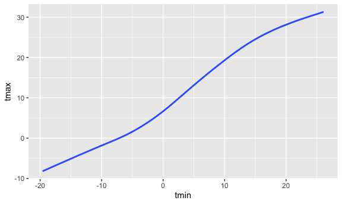
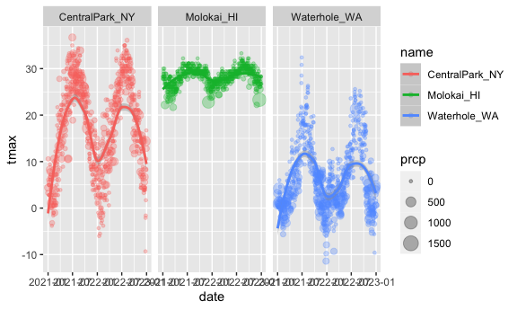
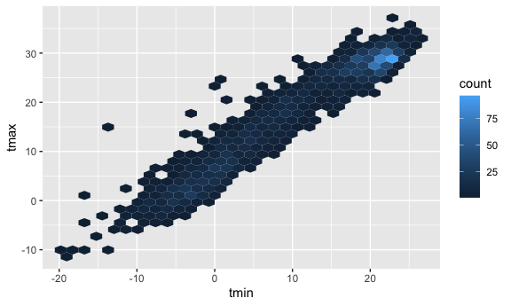
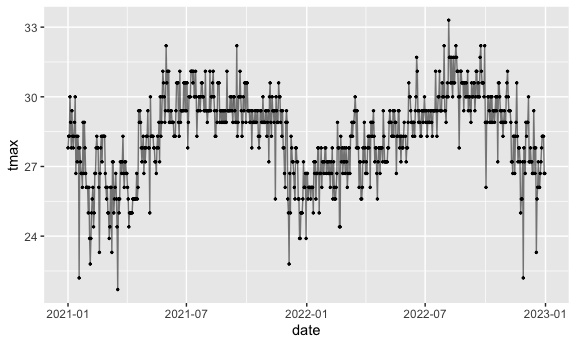
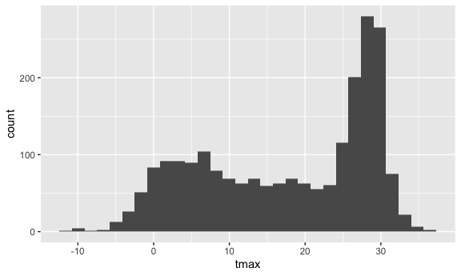

Viz part 1
================
ASHLEY ROMO
2023-10-05

``` r
library(tidyverse)
```

    ## ── Attaching core tidyverse packages ──────────────────────── tidyverse 2.0.0 ──
    ## ✔ dplyr     1.1.3     ✔ readr     2.1.4
    ## ✔ forcats   1.0.0     ✔ stringr   1.5.0
    ## ✔ ggplot2   3.4.3     ✔ tibble    3.2.1
    ## ✔ lubridate 1.9.2     ✔ tidyr     1.3.0
    ## ✔ purrr     1.0.2     
    ## ── Conflicts ────────────────────────────────────────── tidyverse_conflicts() ──
    ## ✖ dplyr::filter() masks stats::filter()
    ## ✖ dplyr::lag()    masks stats::lag()
    ## ℹ Use the conflicted package (<http://conflicted.r-lib.org/>) to force all conflicts to become errors

``` r
library(ggridges)

# setting the width and height of the plots
knitr::opts_chunk$set(
  fig.width = 6,
  fig.asp = .6,
  out.width = "90%"
)
```

``` r
weather_df = 
  rnoaa::meteo_pull_monitors(
    c("USW00094728", "USW00022534", "USS0023B17S"),
    var = c("PRCP", "TMIN", "TMAX"), 
    date_min = "2021-01-01",
    date_max = "2022-12-31") |>
  mutate(
    name = recode(
      id, 
      USW00094728 = "CentralPark_NY", 
      USW00022534 = "Molokai_HI",
      USS0023B17S = "Waterhole_WA"),
    tmin = tmin / 10,
    tmax = tmax / 10) |>
  select(name, id, everything())
```

    ## using cached file: /Users/ashleyromo/Library/Caches/org.R-project.R/R/rnoaa/noaa_ghcnd/USW00094728.dly

    ## date created (size, mb): 2023-10-05 18:05:30.264135 (8.534)

    ## file min/max dates: 1869-01-01 / 2023-10-31

    ## using cached file: /Users/ashleyromo/Library/Caches/org.R-project.R/R/rnoaa/noaa_ghcnd/USW00022534.dly

    ## date created (size, mb): 2023-10-05 18:05:45.821928 (3.839)

    ## file min/max dates: 1949-10-01 / 2023-10-31

    ## using cached file: /Users/ashleyromo/Library/Caches/org.R-project.R/R/rnoaa/noaa_ghcnd/USS0023B17S.dly

    ## date created (size, mb): 2023-10-05 18:05:50.763023 (0.997)

    ## file min/max dates: 1999-09-01 / 2023-10-31

Let’s make a plot

``` r
#ggplot(dataframe, aes(x = xvariable, y = y variable)) 
#geom_point() = scatter plot 

ggplot(weather_df, aes(x = tmin, y = tmax)) +
         geom_point()
```

    ## Warning: Removed 17 rows containing missing values (`geom_point()`).


Pipes and stuff

``` r
weather_df |> 
  filter (name == "CentralPark_NY") |> 
  ggplot(aes(x = tmin, y = tmax)) +
  geom_point()
```


``` r
#Save ggplots objects

ggp_nyc_weather = 
  weather_df |> 
  filter (name == "CentralPark_NY") |> 
  ggplot(aes(x = tmin, y = tmax)) +
  geom_point()

ggp_nyc_weather
```


## Fancy plots

``` r
#geom_smooth() makes a smooth 
ggplot(weather_df, aes (x = tmin, y = tmax, color = name)) +
  geom_point() +
  geom_smooth()
```

    ## `geom_smooth()` using method = 'loess' and formula = 'y ~ x'

    ## Warning: Removed 17 rows containing non-finite values (`stat_smooth()`).

    ## Warning: Removed 17 rows containing missing values (`geom_point()`).


``` r
# move aes to inside geom_point() so only the points are assigned to color
# inside geom_point, you can use alpha shading. ex: alpha = 0.3 to make the points 70% opaque or 30% solid 
ggplot(weather_df, aes (x = tmin, y = tmax)) +
  geom_point(aes(color = name), alpha = 0.3)+
  geom_smooth()
```

    ## `geom_smooth()` using method = 'gam' and formula = 'y ~ s(x, bs = "cs")'

    ## Warning: Removed 17 rows containing non-finite values (`stat_smooth()`).
    ## Removed 17 rows containing missing values (`geom_point()`).


``` r
# se = FALSE gets rid of SE 
ggplot(weather_df, aes (x = tmin, y = tmax)) +
  geom_smooth(se = FALSE)
```

    ## `geom_smooth()` using method = 'gam' and formula = 'y ~ s(x, bs = "cs")'

    ## Warning: Removed 17 rows containing non-finite values (`stat_smooth()`).



Plot with facets

``` r
# "." means put everything on this row and then " ~ name" and then have separate columns according to the name variable or whichever variable you chose

ggplot(weather_df, aes(x=tmin, y = tmax, color = name)) +
  geom_point(alpha = 0.3) +
  geom_smooth() +
  facet_grid(. ~ name)
```

    ## `geom_smooth()` using method = 'loess' and formula = 'y ~ x'

    ## Warning: Removed 17 rows containing non-finite values (`stat_smooth()`).

    ## Warning: Removed 17 rows containing missing values (`geom_point()`).


Let’s try a different plot. temps are boring

``` r
ggplot(weather_df, aes(x = date, y = tmax, color = name)) +
  geom_point(aes(size = prcp), alpha = 0.3) +
  geom_smooth() +
  facet_grid (. ~ name)
```

    ## `geom_smooth()` using method = 'loess' and formula = 'y ~ x'

    ## Warning: Removed 17 rows containing non-finite values (`stat_smooth()`).

    ## Warning: Removed 19 rows containing missing values (`geom_point()`).



Try assigning a specific color

``` r
weather_df |> 
  filter(name == "CentralPark_NY") |> 
  ggplot(aes(x = date, y = tmax)) +
  geom_point(color = "blue")
```


``` r
# you should rarely assign colors; let R assign them for you

#if there are 2 data example
# also, you can adjust the size of the dots within geom_point(size = 0.5)
weather_df |> 
  filter(name != "CentralPark_NY") |> 
  ggplot(aes(x = date, y = tmax, color = name)) +
  geom_point(alpha = 0.7, size = 0.5)
```

    ## Warning: Removed 17 rows containing missing values (`geom_point()`).


hex plot

``` r
# to make the dots easier to read --> use geom_hex() which nakes a density plot (kind of like a heat map)

weather_df |> 
  ggplot(aes(x = tmin, y = tmax)) +
  geom_hex()
```

    ## Warning: Removed 17 rows containing non-finite values (`stat_binhex()`).



line plot

``` r
weather_df |> 
  filter(name == "Molokai_HI") |> 
  ggplot(aes(x  = date, y = tmax)) +
  geom_line()
```


``` r
# you can also use geom_line() and geom_point() together

weather_df |> 
  filter(name == "Molokai_HI") |> 
  ggplot(aes(x  = date, y = tmax)) +
  geom_line(alpha = 0.5) + 
  geom_point(size = 0.5)
```

    ## Warning: Removed 1 rows containing missing values (`geom_point()`).



``` r
# line plots are particularly helpful if you are using a longitudianl dataset (ex: if you observations on the same people across different visits)
```

## univariate plotting

Histogram

``` r
ggplot(weather_df, aes(x = tmax)) +
  geom_histogram()
```

    ## `stat_bin()` using `bins = 30`. Pick better value with `binwidth`.

    ## Warning: Removed 17 rows containing non-finite values (`stat_bin()`).



``` r
# to fil the histogram, you can use "fill = variable". ex: fill = name
# you can also make the bars avoid each other by using "position = dodge" within geom_histogram

ggplot(weather_df, aes(x = tmax, fill = name)) +
  geom_histogram(position = "dodge")
```

    ## `stat_bin()` using `bins = 30`. Pick better value with `binwidth`.

    ## Warning: Removed 17 rows containing non-finite values (`stat_bin()`).


Let’s use a density plot

``` r
# desnity plot allows you see the data better especially when you use "alpha = #.#" within geom_density()
# you can also change the smoothness by using "adjust = #"
ggplot(weather_df, aes(x = tmax, fill = name)) +
  geom_density(alpha = 0.3, adjust = 2)
```

    ## Warning: Removed 17 rows containing non-finite values (`stat_density()`).


Using boxplots

``` r
ggplot(weather_df, aes(y = tmax, x = name)) +
  geom_boxplot()
```

    ## Warning: Removed 17 rows containing non-finite values (`stat_boxplot()`).


violin plots?

``` r
ggplot(weather_df, aes(y = tmax, x = name)) +
  geom_violin()
```

    ## Warning: Removed 17 rows containing non-finite values (`stat_ydensity()`).


``` r
# violin plots you take the density plot and turn it vertically and then mirror it
```

ridge plot

``` r
# ridge plots are similar to violin plots but it stackes the densities vertically
ggplot(weather_df, aes(x = tmax, y = name)) +
  geom_density_ridges()
```

    ## Picking joint bandwidth of 1.54

    ## Warning: Removed 17 rows containing non-finite values
    ## (`stat_density_ridges()`).


## saving and embedding plots

``` r
ggp_weather =
  weather_df |> 
  ggplot(aes(x = tmin, y = tmax)) +
  geom_point()

ggsave("results/gg_weather.pdf", ggp_weather)
```

    ## Saving 6 x 3.6 in image

    ## Warning: Removed 17 rows containing missing values (`geom_point()`).

Changing the width and height of the graphs

``` r
ggp_weather
```

    ## Warning: Removed 17 rows containing missing values (`geom_point()`).


