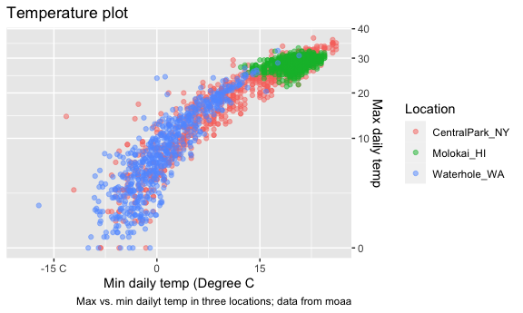

Viz part 2
================
ASHLEY ROMO
2023-10-05

``` r
library(tidyverse)
```

    ## ── Attaching core tidyverse packages ──────────────────────── tidyverse 2.0.0 ──
    ## ✔ dplyr     1.1.3     ✔ readr     2.1.4
    ## ✔ forcats   1.0.0     ✔ stringr   1.5.0
    ## ✔ ggplot2   3.4.3     ✔ tibble    3.2.1
    ## ✔ lubridate 1.9.2     ✔ tidyr     1.3.0
    ## ✔ purrr     1.0.2     
    ## ── Conflicts ────────────────────────────────────────── tidyverse_conflicts() ──
    ## ✖ dplyr::filter() masks stats::filter()
    ## ✖ dplyr::lag()    masks stats::lag()
    ## ℹ Use the conflicted package (<http://conflicted.r-lib.org/>) to force all conflicts to become errors

``` r
# setting the width and height of the plots
knitr::opts_chunk$set(
  fig.width = 6,
  fig.asp = .6,
  out.width = "90%"
)
```

``` r
weather_df = 
  rnoaa::meteo_pull_monitors(
    c("USW00094728", "USW00022534", "USS0023B17S"),
    var = c("PRCP", "TMIN", "TMAX"), 
    date_min = "2021-01-01",
    date_max = "2022-12-31") |>
  mutate(
    name = recode(
      id, 
      USW00094728 = "CentralPark_NY", 
      USW00022534 = "Molokai_HI",
      USS0023B17S = "Waterhole_WA"),
    tmin = tmin / 10,
    tmax = tmax / 10) |>
  select(name, id, everything())
```

    ## using cached file: /Users/ashleyromo/Library/Caches/org.R-project.R/R/rnoaa/noaa_ghcnd/USW00094728.dly

    ## date created (size, mb): 2023-10-05 18:05:30.264135 (8.534)

    ## file min/max dates: 1869-01-01 / 2023-10-31

    ## using cached file: /Users/ashleyromo/Library/Caches/org.R-project.R/R/rnoaa/noaa_ghcnd/USW00022534.dly

    ## date created (size, mb): 2023-10-05 18:05:45.821928 (3.839)

    ## file min/max dates: 1949-10-01 / 2023-10-31

    ## using cached file: /Users/ashleyromo/Library/Caches/org.R-project.R/R/rnoaa/noaa_ghcnd/USS0023B17S.dly

    ## date created (size, mb): 2023-10-05 18:05:50.763023 (0.997)

    ## file min/max dates: 1999-09-01 / 2023-10-31

## sample plot from last time

``` r
# to change labels, use "labs()" function. This changes the x and y axis as well as the name of the legend.

weather_df |> 
  ggplot(aes(x = tmin, y = tmax, color = name)) +
  geom_point(alpha = 0.5) +
  labs(
    title = "Temperature plot",
    x = "Min daily temp (Degree C",
    y = "Max daily temp",
    color = "Location",
    caption = "Max vs. min dailyt temp in three locations; data from moaa"
  )
```

    ## Warning: Removed 17 rows containing missing values (`geom_point()`).


\#Scales

``` r
# breaks allos you to specific when you want the breaks
# you can also transform the y variable by using "trans = ..."
weather_df |> 
  ggplot(aes(x = tmin, y = tmax, color = name)) +
  geom_point(alpha = 0.5) +
  labs(
    title = "Temperature plot",
    x = "Min daily temp (Degree C",
    y = "Max daily temp",
    color = "Location",
    caption = "Max vs. min dailyt temp in three locations; data from moaa"
  ) +
  scale_x_continuous(
    breaks = c(-15, 0, 15),
    labels = c("-15 C", "0", "15")
  ) +
  scale_y_continuous(
    position = "right", 
    trans = "sqrt"
  )
```

    ## Warning in self$trans$transform(x): NaNs produced

    ## Warning: Transformation introduced infinite values in continuous y-axis

    ## Warning: Removed 142 rows containing missing values (`geom_point()`).



``` r
# you can also apply limits. example: "limits = c(#, #)"
weather_df |> 
  ggplot(aes(x = tmin, y = tmax, color = name)) +
  geom_point(alpha = 0.5) +
  labs(
    title = "Temperature plot",
    x = "Min daily temp (Degree C",
    y = "Max daily temp",
    color = "Location",
    caption = "Max vs. min dailyt temp in three locations; data from moaa"
  ) +
  scale_x_continuous(
    breaks = c(-15, 0, 15),
    labels = c("-15 C", "0", "15")
  ) +
  scale_y_continuous(
    position = "right", 
    limits = c(0,30)
  )
```

    ## Warning: Removed 302 rows containing missing values (`geom_point()`).


What about colors?

``` r
# Using viridis package 

weather_df |> 
  ggplot(aes(x = tmin, y = tmax, color = name)) +
  geom_point(alpha = 0.5) +
  labs(
    title = "Temperature plot",
    x = "Min daily temp (Degree C",
    y = "Max daily temp",
    color = "Location",
    caption = "Max vs. min dailyt temp in three locations; data from moaa"
  ) +
  scale_x_continuous(
    breaks = c(-15, 0, 15),
    labels = c("-15 C", "0", "15")
  ) +
  scale_y_continuous(
    position = "right", 
    trans = "sqrt"
  ) + 
  viridis::scale_color_viridis(discrete = TRUE) 
```

    ## Warning in self$trans$transform(x): NaNs produced

    ## Warning: Transformation introduced infinite values in continuous y-axis

    ## Warning: Removed 142 rows containing missing values (`geom_point()`).


